# diachrscripts

This is a collection of Python (3.7) scripts for the analysis of simple and twisted read pairs and interactions.

## Setup

First of all you need to clone this repository and change into the ```diachscripts``` directory with:
```shell script
$ git clone https://github.com/TheJacksonLaboratory/diachrscripts.git
$ cd diachscripts
```

We used ```conda``` to manage the virtual environment.
On a Linux machine, setup the environment as follows:
```shell script
$ conda env create -f environment_linux_p37env.yml
```
On a Mac, setup the environment with a different yml file:
```shell script
$ conda env create -f environment_mac_p37env.yml
```
Active the environment as follows:
```shell script
$ conda activate diachscripts_p37env
```

Install an ipython kernel for the Jupyter notebooks with:
```shell script
python -m ipykernel install --user --name diachscripts_p37env --display-name "Python 3 (diachscripts_p37env)"
```

From this environment start Jupyter notebooks with:
```shell script
(diachscripts_p37env) $ jupyter-notebook
```

Open one of the notebooks in ```diachscripts/jupyter-notebooks``` and choose the right kernel via:

```Kernel -> Change kernel```

Follow the instructions given in the notebook in order to get the required input data and to perform the analyses.

You can select the environment in ```PyCharm``` via:

```Preferences -> Project interpreter -> Add -> Existing environment -> </YOUR/ANACONDA/PATH>/anaconda2/envs/diachrscripts_env/bin/python```

Don't forget to update the YML file after changing the environment.
For this purpose, u         se:
```shell script
(diachscripts_p37env) $ conda env export --no-builds > environment_linux_p37env.yml
```


## Set up (new)

To make a smaller requirements file, we start off like this
```
conda create -n p3dia
```
To check the environment, enter
```
conda activate p3dia
```
To add the packages we need for diachromatic-scripts,
```
pip install --user --requirement requirements.txt
```

We now want to put this kernel into jupypter. We will use the ipykernel package for this.
```
pip install ipykernel
python -m ipykernel install --user
```


## Definition of directed interactions

We carried out the first steps of the analysis on a computing cluster.
This include this step, which is implemented in the following script:
```
diachrscripts/05_define_di_uie_and_uii.py
```
This script uses the previously determined P-value threshold
in order to classify interactions as either directed or undirected.
The result is a file in EI format in which each line stands for one interaction
and the third column indicates whether the interaction is directed or undirected.

To reproduce the analysis steps below on your computer,
download the following files:
```
JAV_MK_RALT_0.0019_enhanced_interaction_file_with_di_uii_and_uie.tsv.gz
JAV_ERY_RALT_0.0018_enhanced_interaction_file_with_di_uii_and_uie.tsv.gz
JAV_NEU_RALT_0.0011_enhanced_interaction_file_with_di_uii_and_uie.tsv.gz
JAV_MON_RALT_0.0012_enhanced_interaction_file_with_di_uii_and_uie.tsv.gz
JAV_MAC_M0_RALT_0.0019_enhanced_interaction_file_with_di_uii_and_uie.tsv.gz
JAV_MAC_M1_RALT_0.0019_enhanced_interaction_file_with_di_uii_and_uie.tsv.gz
JAV_MAC_M2_RALT_0.0019_enhanced_interaction_file_with_di_uii_and_uie.tsv.gz
JAV_EP_RALT_0.0017_enhanced_interaction_file_with_di_uii_and_uie.tsv.gz
JAV_NB_RALT_0.0019_enhanced_interaction_file_with_di_uii_and_uie.tsv.gz
JAV_TB_RALT_0.0019_enhanced_interaction_file_with_di_uii_and_uie.tsv.gz
JAV_FOET_RALT_0.0019_enhanced_interaction_file_with_di_uii_and_uie.tsv.gz
JAV_NCD4_RALT_0.0019_enhanced_interaction_file_with_di_uii_and_uie.tsv.gz
JAV_TCD4_RALT_0.002_enhanced_interaction_file_with_di_uii_and_uie.tsv.gz
JAV_ACD4_RALT_0.0019_enhanced_interaction_file_with_di_uii_and_uie.tsv.gz
JAV_NACD4_RALT_0.0019_enhanced_interaction_file_with_di_uii_and_uie.tsv.gz
JAV_NCD8_RALT_0.0019_enhanced_interaction_file_with_di_uii_and_uie.tsv.gz
JAV_TCD8_RALT_0.0019_enhanced_interaction_file_with_di_uii_and_uie.tsv.gz
```

Place these files in the directory:
```
diachrscripts/results/05_define_directed_interactions
```

Each of these files contains the combined interactions for one of the hematopoietic 17 cell types.

## Selection of undirected reference interactions

Our binomial is underpowered for interactions with few read pairs.
Therefore, we select undirected reference interactions that are comparable
to directed interactions with respect to the distribution of read pair numbers.
This  is implemented in the  script:
```
diachrscripts/06_select_uir_from_uie_and_uii.py
```
Once you have downloaded the files from the previous step and placed them in the
directory in the designated directory, you can select the reference interactions for
each of the 17 cell types by executing the following bash script:
```
bash_scripts/06_select_reference_interactions/06_select_reference_interactions_run_4_all.sh
```
This script writes the results to the directory:
```
results/06_select_reference_interactions/
```
whereby a separate subdirectory is created for each cell type.

## Analysis of interaction distances

To compare directed and undirected interactions, we have decomposed the into different categories.
At the top level, we differentiate between directed (*DI*), undirected reference (*UIR*), and undirected interactions (*UI*).
We further break down directed interactions into the categories *simple* and *twisted*,
depending which of the two types of read pairs predominates.
At the lowest level, we differentiate interactions with regard to their enrichment status,
i.e. whether both digests (*EE*), the second digest (*NE*), the first digest (*EN*)
or neither of the two digests (*NN*) were selected for target enrichment.
Note that the distinction between *NE* and *EN* is also a distinction with regard to the direction,
i.e. whether an interaction, viewed from the enriched digest, goes to the left or right.

For undirected interactions, a distinction between *simple* and *twisted* is not possible,
as neither of the two read pair types predominates.
In order to extend our comparison between *simple* and *twisted* to undirected interactions,
we made an additional analysis at the level of read pairs.
For this purpose, we keep the division into *DI*, *UIR* and *UI*,
but read pairs between given digests are no longer combined into interactions.
If, for example, an interaction has 29 simple and 27 twisted read pairs,
then the interaction distance goes 29 times into the corresponding distribution of distances for simple
and 27 times into the distance distribution for twisted.

At the level of interactions, the decomposition results in 20 subcategories:

1. **Directed interactions** are decomposed into simple and twisted interactions.
There is also a category that contains all directed interactions,
i.e. simple and twisted interactions.
Within these three categories, we differentiate interactions according to the enrichment
status of the digests involved (*EE*, *NE*, *EN* or *NN*). This results in 12 categories.

2. **Undirected reference interactions** cannot be decomposed into simple and twisted interactions
and are decomposed according the enrichment status, resulting in four categories.

3. **Undirected interactions** cannot be decomposed into simple and twisted interactions either,
and there are only four categories for the enrichment states of involved digests.


At the level of read pairs, all three categories can be decomposed into simple and twisted
interactions, which are further differentiated according to enrichment status,
which results in 24 subcategories.

The script:
```
diachrscripts/07_analyze_interaction_distances.py
```
implements the decomposition of interactions and creates one file for each subcategory
that contains one distance in each line.
 
The script has the following parameters:
```
--out-prefix
```
The name of each created file will have this prefix,
which can also contain the path to an already existing directory.
```
--enhanced-interaction-file <OUT_PREFIX>_enhanced_interaction_file_with_di_ui_and_uir.tsv.gz
```
A file in enhanced interaction format that was created with the script `06_select_uir_from_uie_and_uii.py`.
The interaction distances are taken from the second column of this file.
The interaction distance is defined as the distance between the end of the first
and the beginning of the first digest (in sequential order).
The distance is currently calculated in the script `04_extract_gene_symbols_and_tss.py`.
The third column contains the tag for the interaction category that
is either `DI`, `UIR` or `UI`.
Whether an interaction is *simple* or *twisted* is decided on the basis of the read
pair counts in the fifth column.
The enrichment states are taken from the sixth column.

For each of the 44 subcategories, the script creates a text file that contains an
interaction distance in each line. For the analysis at the interaction level,
the following files will be created:
```
# Directed interactions
<OUT_PREFIX>_di_ee_dist_array.tab
<OUT_PREFIX>_di_ne_dist_array.tab
<OUT_PREFIX>_di_en_dist_array.tab
<OUT_PREFIX>_di_nn_dist_array.tab

# Undirected reference interactions
<OUT_PREFIX>_uir_ee_dist_array.tab
<OUT_PREFIX>_uir_ne_dist_array.tab
<OUT_PREFIX>_uir_en_dist_array.tab
<OUT_PREFIX>_uir_nn_dist_array.tab

# Undirected  interactions
<OUT_PREFIX>_ui_ee_dist_array.tab
<OUT_PREFIX>_ui_ne_dist_array.tab
<OUT_PREFIX>_ui_en_dist_array.tab
<OUT_PREFIX>_ui_nn_dist_array.tab

# Directed simple interactions
<OUT_PREFIX>_di_ee_s_dist_array.tab
<OUT_PREFIX>_di_ne_s_dist_array.tab
<OUT_PREFIX>_di_en_s_dist_array.tab
<OUT_PREFIX>_di_nn_s_dist_array.tab

# Directed twisted interactions
<OUT_PREFIX>_di_ee_t_dist_array.tab
<OUT_PREFIX>_di_ne_t_dist_array.tab
<OUT_PREFIX>_di_en_t_dist_array.tab
<OUT_PREFIX>_di_nn_t_dist_array.tab
```

For the analysis at the read pair level, the following files will be created:
```
# Simple read pairs from directed interactions
<OUT_PREFIX>_di_ee_s_rp_dist_array.tab
<OUT_PREFIX>_di_ne_s_rp_dist_array.tab
<OUT_PREFIX>_di_en_s_rp_dist_array.tab
<OUT_PREFIX>_di_nn_s_rp_dist_array.tab

# Twisted read pairs from directed interactions
<OUT_PREFIX>_di_ee_t_rp_dist_array.tab
<OUT_PREFIX>_di_ne_t_rp_dist_array.tab
<OUT_PREFIX>_di_en_t_rp_dist_array.tab
<OUT_PREFIX>_di_nn_t_rp_dist_array.tab

# Simple read pairs from undirected reference interactions
<OUT_PREFIX>_uir_ee_s_rp_dist_array.tab
<OUT_PREFIX>_uir_ne_s_rp_dist_array.tab
<OUT_PREFIX>_uir_en_s_rp_dist_array.tab
<OUT_PREFIX>_uir_nn_s_rp_dist_array.tab

# Twisted read pairs from undirected reference interactions
<OUT_PREFIX>_uir_ee_t_rp_dist_array.tab
<OUT_PREFIX>_uir_ne_t_rp_dist_array.tab
<OUT_PREFIX>_uir_en_t_rp_dist_array.tab
<OUT_PREFIX>_uir_nn_t_rp_dist_array.tab

# Simple read pairs from undirected interactions
<OUT_PREFIX>_ui_ee_s_rp_dist_array.tab
<OUT_PREFIX>_ui_ne_s_rp_dist_array.tab
<OUT_PREFIX>_ui_en_s_rp_dist_array.tab
<OUT_PREFIX>_ui_nn_s_rp_dist_array.tab

# Simple read pairs from undirected interactions
<OUT_PREFIX>_ui_ee_t_rp_dist_array.tab
<OUT_PREFIX>_ui_ne_t_rp_dist_array.tab
<OUT_PREFIX>_ui_en_t_rp_dist_array.tab
<OUT_PREFIX>_ui_nn_t_rp_dist_array.tab
``` 

The files generated are read in by following four R scripts for further analysis:
``` 
rscripts/07_analyze_interaction_distances/analyze_summary_stats.r
rscripts/07_analyze_interaction_distances/analyze_summary_stats_st.r
rscripts/07_analyze_interaction_distances/interaction_distances.r
rscripts/07_analyze_interaction_distances/interaction_distances_st.r
``` 
Variables and functions that are used in more than one R script are in
the following file: 
``` 
rscripts/07_analyze_interaction_distances/interaction_distances_lib.R
``` 

### Comparison of DI, UIR and UI interactions

The first R script is for comparing the distances between directed (DI), undirected
reference (UIR) and undirected interactions (UI) and is executed as follows:
```
Rscript --vanilla rscripts/07_analyze_interaction_distances/interaction_distances.r \
<OUT_DIR>/ \
<OUT_PREFIX> \
<OUT_PREFIX>_di_ee_dist_array.tab \
<OUT_PREFIX>_di_ne_dist_array.tab \
<OUT_PREFIX>_di_en_dist_array.tab \
<OUT_PREFIX>_di_nn_dist_array.tab \
<OUT_PREFIX>_uir_ee_dist_array.tab \
<OUT_PREFIX>_uir_ne_dist_array.tab \
<OUT_PREFIX>_uir_en_dist_array.tab \
<OUT_PREFIX>_uir_nn_dist_array.tab \
<OUT_PREFIX>_ui_ee_dist_array.tab \
<OUT_PREFIX>_ui_ne_dist_array.tab \
<OUT_PREFIX>_ui_en_dist_array.tab \
<OUT_PREFIX>_ui_nn_dist_array.tab
```
The first argument (`<OUT_DIR>/`) is the directory to which the results will be written.
The second argument (`<OUT_PREFIX>`) is used as prefix for the names of the generated files.
This is followed by 12 files that contain the interaction distances for DI, UIR, UI
within the enrichment categories `EE`, `NE`, `EN` and `NN`.

The script produces two files, a PDF file with histograms and a TSV file with
summary statistics.

The PDF file
```
<OUT_PREFIX>_i_distance_statistics_ee_ne_en_nn.pdf
```
contains a field of histograms for the distributions of distances
in the 12 subcategories.

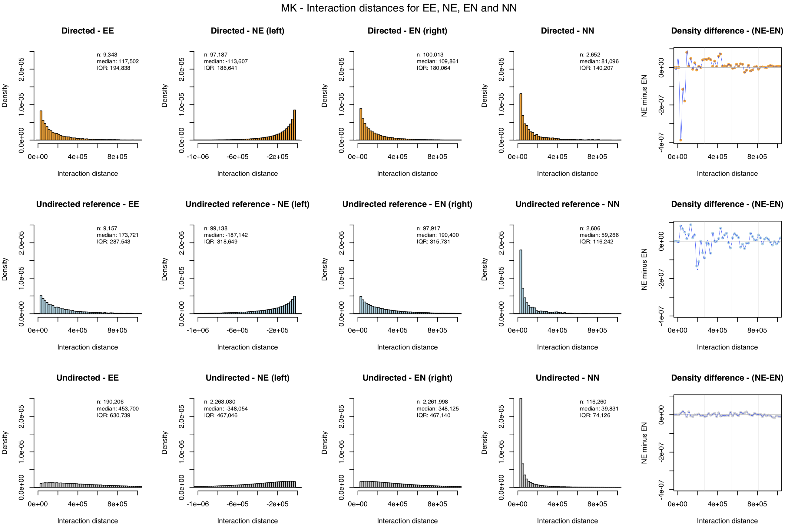

The first line of this field contains the histograms for DI (orange) and `EE`, `NE`, `EN` and `NN`.
The following two lines have the same structure and are for UIR (light blue) and UI (gray).
The axes of all histograms have the same range. Therefore, the histograms can be compared
with each other. To compare at which distances the distributions for NE and EN differ,
we subtract the densities within each bin of the histograms for NE and EN.
The differences are shown to the right of the histograms for DI, UIR and UI.

Below the histograms, further plots with density differences are shown,
in which the densities of the interactionn categories DI, UIR and UI
are compared.

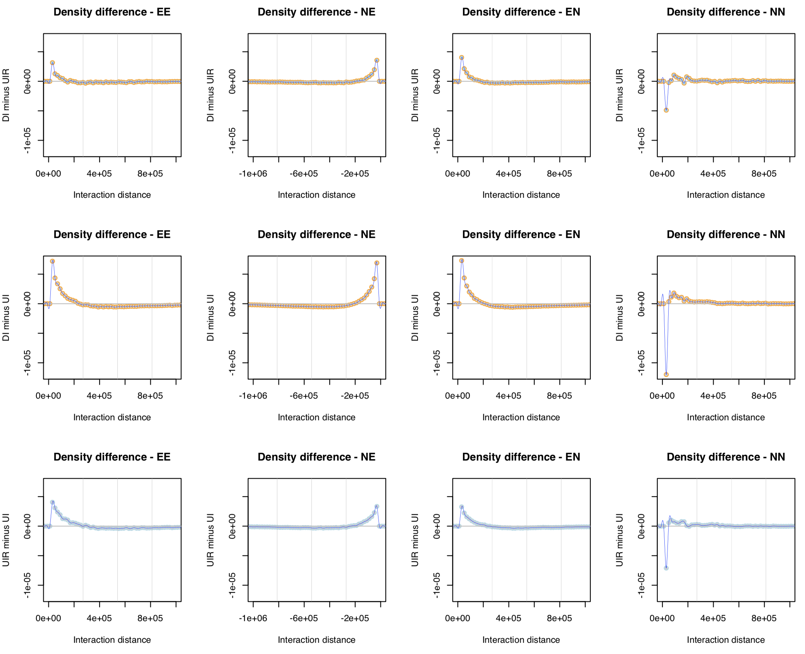

As with the histograms, the columns are in the order EE, NE, EN, NN.
In row 1 (row 4 in the full plot) are the density differences DI minus UIR.
Rows 2 and 3 contain the density differences DI minus UI and UIR minus UI.

Three summary statistics are determined for each subcategory:

1. Number of interactions (**n**)

2. Median interaction distance (**median**)

3. Interquartile ranges (**IQR**)
 
We use the IQR as a measure for dispersion.
The IQR is defined as the difference between the 75th (Q3) and 25th (Q1) percentiles,
i.e. the range that contains the middle 50% of the distances.
The IQR corresponds to the length of the box in a boxplot.
These summary statistics are shown in the legends of the histograms and are also written to
a TSV file with the name:
```
<OUT_PREFIX>_i_distance_statistics_ee_ne_en_nn.tsv
```

This file contains only one header line and one line with the corresponding 36 values
(12 each for *n*, *median* and *IQR*).
```
OUT_PREFIX	DI_EE_N	DI_NE_N	DI_EN_N	DI_NN_N	UIR_EE_N	UIR_NE_N	UIR_EN_N	UIR_NN_N	UI_EE_N	UI_NE_N	UI_EN_N	UI_NN_N	DI_EE_MED	DI_NE_MED	DI_EN_MED	DI_NN_MED	UIR_EE_MED	UIR_NE_MED	UIR_EN_MED	UIR_NN_MED	UI_EE_MED	UI_NE_MED	UI_EN_MED	UI_NN_MED	DI_EE_IQR	DI_NE_IQR	DI_EN_IQR	DI_NN_IQR	UIR_EE_IQR	UIR_NE_IQR	UIR_EN_IQR	UIR_NN_IQR	UI_EE_IQR	UI_NE_IQR	UI_EN_IQR	UI_NN_IQR
MK	9343	97187	100013	2652	9157	99138	97917	2606	190206	2263030	2261998	116260	117502	113607	109861	81096	173721	187142	190400	59266	453700	348054	348125	39831	194838	186641	180064	140207	287543	318649	315731	116242	630739	467046	467140	74126
```
The TSV files will later be used to perform a combined analysis for all cell types.

### Comparison of simple and twisted interactions

The second R script is for comparing the distances between simple and twisted interactions
and is executed as follows:
```
Rscript --vanilla rscripts/07_analyze_interaction_distances/interaction_distances_st.r \
$OUT_DIR/ \
OUT_PREFIX \
<OUT_PREFIX>_di_ee_s_dist_array.tab \ # Directed interactions
<OUT_PREFIX>_di_ne_s_dist_array.tab \
<OUT_PREFIX>_di_en_s_dist_array.tab \
<OUT_PREFIX>_di_nn_s_dist_array.tab \
<OUT_PREFIX>_di_ee_t_dist_array.tab \
<OUT_PREFIX>_di_ne_t_dist_array.tab \
<OUT_PREFIX>_di_en_t_dist_array.tab \
<OUT_PREFIX>_di_nn_t_dist_array.tab \
<OUT_PREFIX>_di_ee_s_rp_dist_array.tab \ # Read pairs from directed interactions
<OUT_PREFIX>_di_ne_s_rp_dist_array.tab \
<OUT_PREFIX>_di_en_s_rp_dist_array.tab \
<OUT_PREFIX>_di_nn_s_rp_dist_array.tab \
<OUT_PREFIX>_di_ee_t_rp_dist_array.tab \
<OUT_PREFIX>_di_ne_t_rp_dist_array.tab \
<OUT_PREFIX>_di_en_t_rp_dist_array.tab \
<OUT_PREFIX>_di_nn_t_rp_dist_array.tab \
<OUT_PREFIX>_uir_ee_s_rp_dist_array.tab \ # Read pairs from undirected reference interactions
<OUT_PREFIX>_uir_ne_s_rp_dist_array.tab \
<OUT_PREFIX>_uir_en_s_rp_dist_array.tab \
<OUT_PREFIX>_uir_nn_s_rp_dist_array.tab \
<OUT_PREFIX>_uir_ee_t_rp_dist_array.tab \
<OUT_PREFIX>_uir_ne_t_rp_dist_array.tab \
<OUT_PREFIX>_uir_en_t_rp_dist_array.tab \
<OUT_PREFIX>_uir_nn_t_rp_dist_array.tab \
<OUT_PREFIX>_ui_ee_s_rp_dist_array.tab \ # Read pairs from undirected interactions
<OUT_PREFIX>_ui_ne_s_rp_dist_array.tab \
<OUT_PREFIX>_ui_en_s_rp_dist_array.tab \
<OUT_PREFIX>_ui_nn_s_rp_dist_array.tab \
<OUT_PREFIX>_ui_ee_t_rp_dist_array.tab \
<OUT_PREFIX>_ui_ne_t_rp_dist_array.tab \
<OUT_PREFIX>_ui_en_t_rp_dist_array.tab \
<OUT_PREFIX>_ui_nn_t_rp_dist_array.tab \
```
As with the first R script, the first argument (`<OUT_DIR>/`) is the directory to which the results will be written,
and the second argument (`<OUT_PREFIX>`) is used as prefix for the names of the generated files.
This is followed by 32 files that contain the distances of:

1. Directed interactions
2. Read pairs from directed interactions
3. Read pairs from undirected reference interactions
4. Read pairs from undirected interactions

There are eight files for each of these four categories
(`EE`, `NE`, `EN` and `NN` each for simple and twisted).
And for each of these categories, a PDF file,
similarly structured to the one for the comparison of DI, UIR and UI,
will be generated.

The first PDF file
```
<OUT_PREFIX>_di_distance_histograms_st_ee_ne_en_nn.pdf
```
contains histograms for the distances of directed interactions.

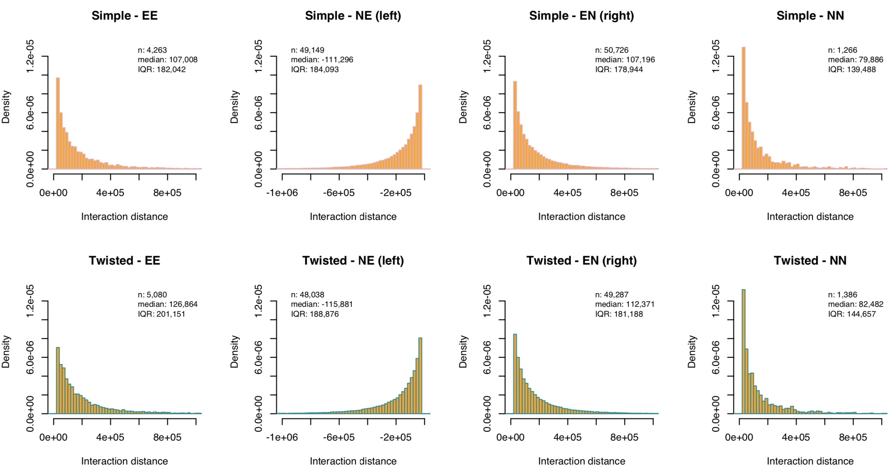

The first line is for simple and the second line for twisted interactions.
The four columns correspond to the enrichment categories `EE`, `NE`, `EN` and `NN`.
The bars of the histograms have pink borders for simple and green borders for twisted interactions.
As with the histograms for the comparison of DI, UIR and UI,
the density differences of NE and EN within the individual bins
are shown to the left of the histograms.
The density differences between *simple* and *twisted* interaactions
are shown below the histograms.

The second PDF file
```
<OUT_PREFIX>_di_rp_distance_histograms_st_ee_ne_en_nn.pdf
```
looks very similar to the first PDF file,
but is for the distances of simple and twisted *read pairs* from directed interactions
(compare the values for n in the legends).

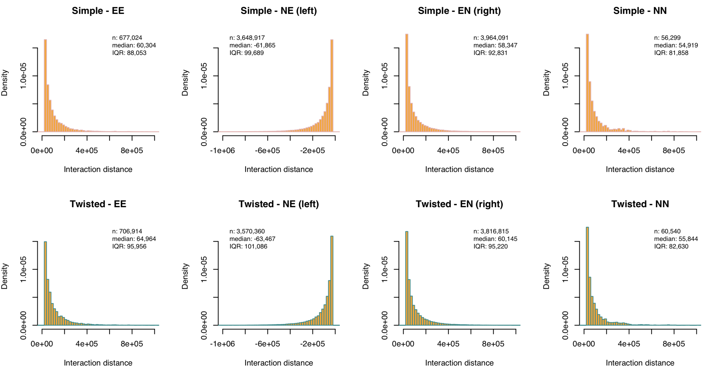

The third PDF file
```
<OUT_PREFIX>_uir_rp_distance_histograms_st_ee_ne_en_nn.pdf
```
is for the distances of simple and twisted *read pairs* from undirected reference interactions.

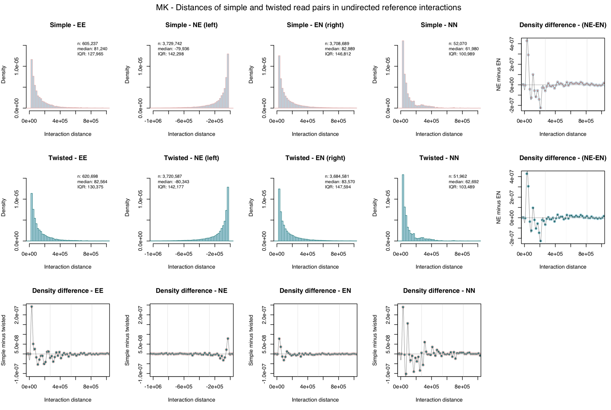

And the fourth PDF file
```
<OUT_PREFIX>_ui_rp_distance_histograms_st_ee_ne_en_nn.pdf
``` 
is for the distances of simple and twisted *read pairs* from undirected interactions.

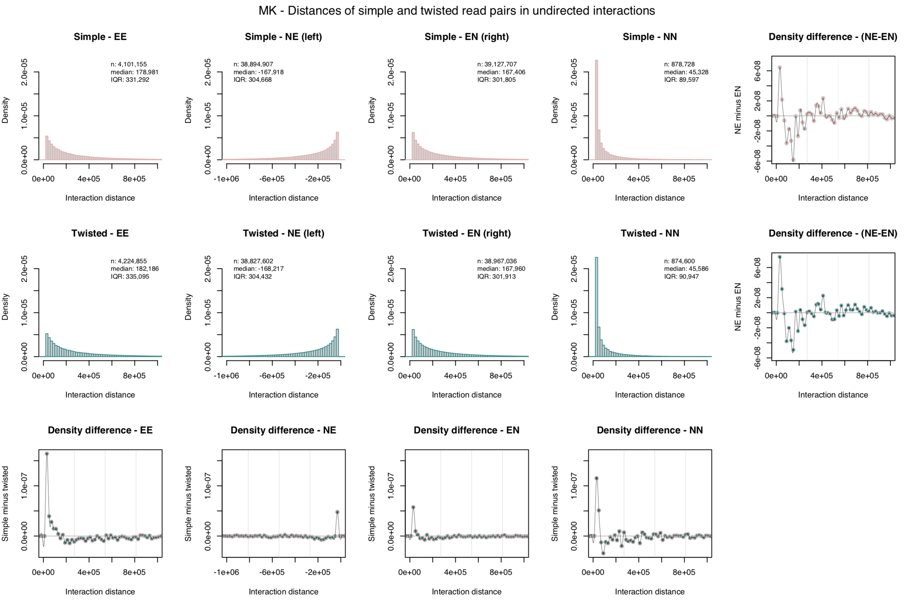


As with the comparison of DI, UIR and UI,
the values from the legends are written to a TSV file
```
<OUT_PREFIX>_st_distance_statistics_ee_ne_en_nn.tsv
```
so as they can be used for a subsequent higher-level analysis across all cell types.
This file contains only one header line and one line with the corresponding 96 values
(32 each for *n*, *median* and *IQR*).
```
OUT_PREFIX	DI_EE_S_N	DI_NE_S_N	DI_EN_S_N	DI_NN_S_N	DI_EE_T_N	DI_NE_T_N	DI_EN_T_N	DI_NN_T_N	DI_EE_S_RP_N	DI_NE_S_RP_N	DI_EN_S_RP_N	DI_NN_S_RP_N	DI_EE_T_RP_N	DI_NE_T_RP_N	DI_EN_T_RP_N	DI_NN_T_RP_N	UIR_EE_S_RP_N	UIR_NE_S_RP_N	UIR_EN_S_RP_N	UIR_NN_S_RP_N	UIR_EE_T_RP_N	UIR_NE_T_RP_N	UIR_EN_T_RP_N	UIR_NN_T_RP_N	UI_EE_S_RP_N	UI_NE_S_RP_N	UI_EN_S_RP_N	UI_NN_S_RP_N	UI_EE_T_RP_N	UI_NE_T_RP_N	UI_EN_T_RP_N	UI_NN_T_RP_N	DI_EE_S_MED	DI_NE_S_MED	DI_EN_S_MED	DI_NN_S_MED	DI_EE_T_MED	DI_NE_T_MED	DI_EN_T_MED	DI_NN_T_MED	DI_EE_S_RP_MED	DI_NE_S_RP_MED	DI_EN_S_RP_MED	DI_NN_S_RP_MED	DI_EE_T_RP_MED	DI_NE_T_RP_MED	DI_EN_T_RP_MED	DI_NN_T_RP_MED	UIR_EE_S_RP_MED	UIR_NE_S_RP_MED	UIR_EN_S_RP_MED	UIR_NN_S_RP_MED	UIR_EE_T_RP_MED	UIR_NE_T_RP_MED	UIR_EN_T_RP_MED	UIR_NN_T_RP_MED	UI_EE_S_RP_MED	UI_NE_S_RP_MED	UI_EN_S_RP_MED	UI_NN_S_RP_MED	UI_EE_T_RP_MED	UI_NE_T_RP_MED	UI_EN_T_RP_MED	UI_NN_T_RP_MED	DI_EE_S_IQR	DI_NE_S_IQR	DI_EN_S_IQR	DI_NN_S_IQR	DI_EE_T_IQR	DI_NE_T_IQR	DI_EN_T_IQR	DI_NN_T_IQR	DI_EE_S_RP_IQR	DI_NE_S_RP_IQR	DI_EN_S_RP_IQR	DI_NN_S_RP_IQR	DI_EE_T_RP_IQR	DI_NE_T_RP_IQR	DI_EN_T_RP_IQR	DI_NN_T_RP_IQR	UIR_EE_S_RP_IQR	UIR_NE_S_RP_IQR	UIR_EN_S_RP_IQR	UIR_NN_S_RP_IQR	UIR_EE_T_RP_IQR	UIR_NE_T_RP_IQR	UIR_EN_T_RP_IQR	UIR_NN_T_RP_IQR	UI_EE_S_RP_IQR	UI_NE_S_RP_IQR	UI_EN_S_RP_IQR	UI_NN_S_RP_IQR	UI_EE_T_RP_IQR	UI_NE_T_RP_IQR	UI_EN_T_RP_IQR	UI_NN_T_RP_IQR
MK	4263	49149	50726	1266	5080	48038	49287	1386	677024	3648917	3964091	56299	706914	3570360	3816815	60540	605237	3729742	3708689	52070	620698	3720587	3684581	51962	4101155	38894907	39127707	878728	4224855	38827602	38967036	874600	107008	-111296	107196	79886	126864	-115881	112371	82482	60304	-61865	58347	54919	64964	-63467	60145	55844	81240	-79936	82989	61980	82564	-80343	83570	62692	178981	-167918	167406	45328	182186	-168217	167960	45586	182042	184093	178944	139488	201151	188876	181188	144657	88053	99689	92831	81858	95956	101086	95220	82630	127965	142298	146812	100989	130375	142177	147594	103489	331292	304668	301805	89597	335095	304432	301913	90947
```

The TSV files will later be used to perform a combined analysis for all cell types.

### Subordinate analysis of DI, UIR and UI

The previous analyzes were for the individual cell types.
In each of these analyzes, the following three summary statistics were calculated for each subcategory of interactions:

1. Number of interactions (**n**)
2. Median interaction distance (**median**)
3. Interquartile ranges (**IQR**)

For each cell type, these satistics were written to the following TSV file:
```
<OUT_PREFIX>_i_distance_statistics_ee_ne_en_nn.tsv
```

In this subordinate analysis,
the summary statistics for all 17 cell types are read from the TSV files
into an R script for a combined analysis.

The R script is executed as follows:


```
Rscript --vanilla rscripts/07_analyze_interaction_distances/analyze_summary_stats.R \
<OUT_DIR>/ \
<OUT_PREFIX> \
<MM_TITLE_SUFFIX> \
"MK_i_distance_statistics_ee_ne_en_nn.tsv" \
"ERY_i_distance_statistics_ee_ne_en_nn.tsv" \
"NEU_i_distance_statistics_ee_ne_en_nn.tsv" \
"MON_i_distance_statistics_ee_ne_en_nn.tsv" \
"MAC_M0_i_distance_statistics_ee_ne_en_nn.tsv" \
"MAC_M1_i_distance_statistics_ee_ne_en_nn.tsv" \
"MAC_M2_i_distance_statistics_ee_ne_en_nn.tsv" \
"EP_i_distance_statistics_ee_ne_en_nn.tsv" \
"NB_i_distance_statistics_ee_ne_en_nn.tsv" \
"TB_i_distance_statistics_ee_ne_en_nn.tsv" \
"FOET_i_distance_statistics_ee_ne_en_nn.tsv" \
"NCD4_i_distance_statistics_ee_ne_en_nn.tsv" \
"TCD4_i_distance_statistics_ee_ne_en_nn.tsv" \
"NACD4_i_distance_statistics_ee_ne_en_nn.tsv" \
"ACD4_i_distance_statistics_ee_ne_en_nn.tsv" \
"NCD8_i_distance_statistics_ee_ne_en_nn.tsv" \
"TCD8_i_distance_statistics_ee_ne_en_nn.tsv"
```

As with the other R scripts, the first argument (`<OUT_DIR>/`) is the directory to which the results will be written,
and the second argument (`<OUT_PREFIX>`) is used as prefix for the names of the generated files.
As a third argument (`<MM_TITLE_SUFFIX>`),
a short label can be given that appears in the heading of the plot that will be generated.
This is followed by 17 TSV files that contain the summary statistics for the individual cell types.

#### Generated plots

The R script creates one PDF files for each of the three summary statistics *n*, *median* and *IQR*:
```
interaction_distance_summary_stats_n.pdf
interaction_distance_summary_stats_median.pdf
interaction_distance_summary_stats_iqr.pdf
```
These files are intended to provide an overview.
Each file contains the same plots in the same order.

##### Interaction numbers (n)

In the following,
the structure of the PDF files is described using the file for the interaction numbers as an example.

In the top four rows, DI, UIR and UI are compared with one another.

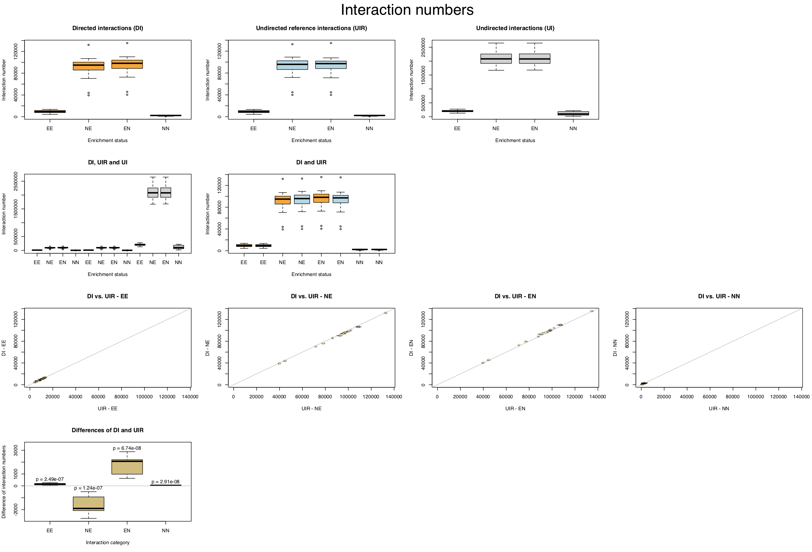

The first row contains three boxplots for DI, UIR and UI.
Within the individual plots, the distributions of interaction numbers from the 17 cell types
are shown separately for `EE`, `NE`, `EN` and `NN`.
In the second row,
the distributions for DI, UIR and UI are shown together in one plot so that they can be compared with one another.
The first plot in this row contains the distribution for DI, UIR and UI,
while the second plot contains the distributions for DI and UIR only.
The third row contains an alternative representation of the data for DI and UIR,
with the interaction numbers for DI and UIR are shown as scatterplots
separately for `EE`, `NE`, `EN` and `NN`.
The fourth row contains another alternative representation of the data for DI and UIR.
In this representation, the differences of interaction numbers for DI and UIR
are shown separately for `EE`, `NE`, `EN` and `NN`.
Under the null hypothesis that DI and UIR do not differ,
these differences should be evenly distributed around zero.
We use a t-test to test this hypothesis.
The corresponding P-values are shown above the top whiskers.

In the lower four rows, the enrichment categories NE and EN are compared within DI, UIR and UI.

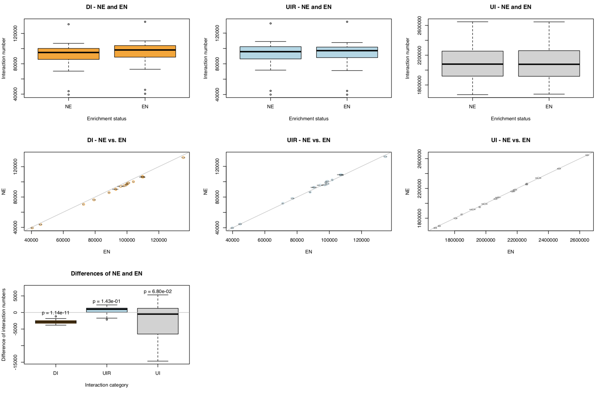

The first row contains three boxplots for DI, UIR and UI.
Within the individual plots, the distributions of interaction numbers from the 17 cell types
are shown separately for `NE` and `EN`.
The second row contains an alternative representation of the data for `NE` and `EN`,
with the interaction numbers for `NE` and `EN` are shown as scatterplots
separately for DI, UIR and UI.
The third row contains another alternative representation of the data for `NE` and `EN`.
In this representation, the differences of interaction numbers for `NE` and `EN`
are shown separately for DI, UIR and UI.
Under the null hypothesis that `NE` and `EN` do not differ,
these differences should be evenly distributed around zero.
We use a t-test to test this hypothesis.
The corresponding P-values are shown above the top whiskers.

##### Median interaction distances (median)

The following plot has the same structure as the one for
interaction and read pair numbers just described.
But this plot is for medians of interaction distances.

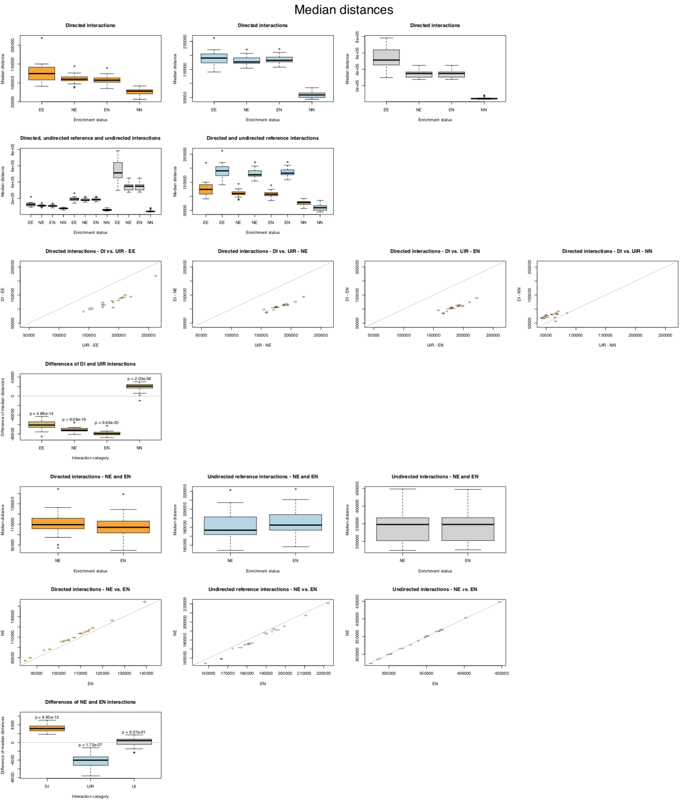


##### Interquartile ranges (IQR)

The following plot has the same structure as the one for
interaction and read pair numbers just described.
But this plot is for interquartile ranges of interaction distances.

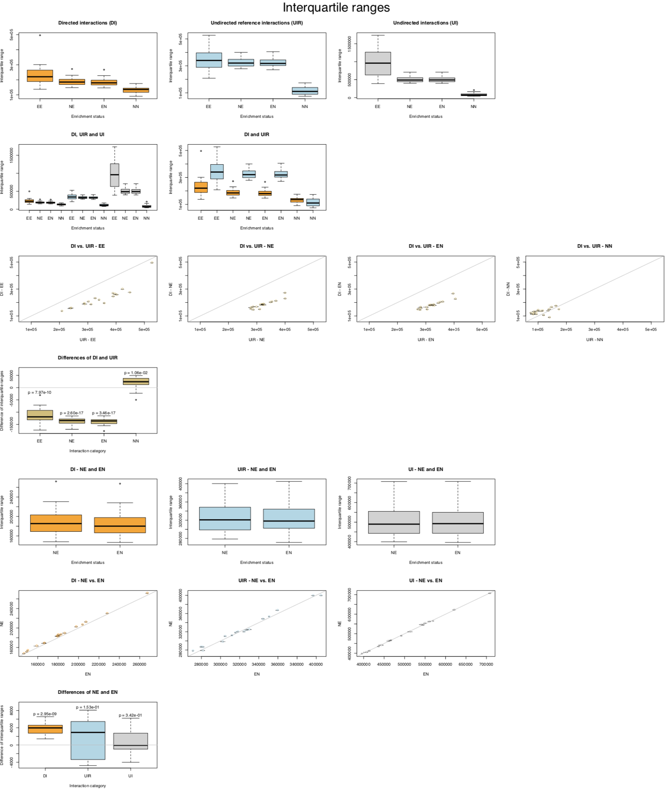


### Subordinate analysis of simple and twisted interactions and read pairs

As with the comparison of directed and undirected interactions,
TSV files with interaction numbers and medians and interquartile ranges
of interaction distances are also generated for the simple/twisted comparison:
```
<OUT_PREFIX>_st_distance_statistics_ee_ne_en_nn.tsv
```

In this subordinate analysis of simple and twisted interactions and
read pairs, the summary statistics for all 17 cell types are read
from the TSV files into an R script for a combined analysis.

The R script is executed as follows:
```
Rscript --vanilla rscripts/07_analyze_interaction_distances/analyze_summary_stats_st.R \
<OUT_DIR>/ \
<OUT_PREFIX> \
<MM_TITLE_SUFFIX> \
"MK_st_distance_statistics_ee_ne_en_nn.tsv" \
"ERY_st_distance_statistics_ee_ne_en_nn.tsv" \
"NEU_st_distance_statistics_ee_ne_en_nn.tsv" \
"MON_st_distance_statistics_ee_ne_en_nn.tsv" \
"MAC_M0_st_distance_statistics_ee_ne_en_nn.tsv" \
"MAC_M1_st_distance_statistics_ee_ne_en_nn.tsv" \
"MAC_M2_st_distance_statistics_ee_ne_en_nn.tsv" \
"EP_st_distance_statistics_ee_ne_en_nn.tsv" \
"NB_st_distance_statistics_ee_ne_en_nn.tsv" \
"TB_st_distance_statistics_ee_ne_en_nn.tsv" \
"FOET_st_distance_statistics_ee_ne_en_nn.tsv" \
"NCD4_st_distance_statistics_ee_ne_en_nn.tsv" \
"TCD4_st_distance_statistics_ee_ne_en_nn.tsv" \
"NACD4_st_distance_statistics_ee_ne_en_nn.tsv" \
"ACD4_st_distance_statistics_ee_ne_en_nn.tsv" \
"NCD8_st_distance_statistics_ee_ne_en_nn.tsv" \
"TCD8_st_distance_statistics_ee_ne_en_nn.tsv" \
```
As with the other R scripts, the first argument (`<OUT_DIR>/`) is the directory to which the results will be written,
and the second argument (`<OUT_PREFIX>`) is used as prefix for the names of the generated files.
As a third argument (`<MM_TITLE_SUFFIX>`),
a short label can be given that appears in the heading of the plot that will be generated.
This is followed by 17 TSV files that contain the summary statistics for the individual cell types.

#### Generated plots

The R script creates one PDF files for each of the three summary statistics n, median and IQR:

```
interaction_distance_summary_stats_st_n.pdf
interaction_distance_summary_stats_st_median.pdf
interaction_distance_summary_stats_st_iqr.pdf
```
Each file contains the same plots in the same order.

##### Interaction numbers (n)

In the following, the structure of the PDF files is described using the file
for the interaction and read pair numbers as an example.

In the top three rows, simple and twisted interactions and read pairs
are compared using boxplots.

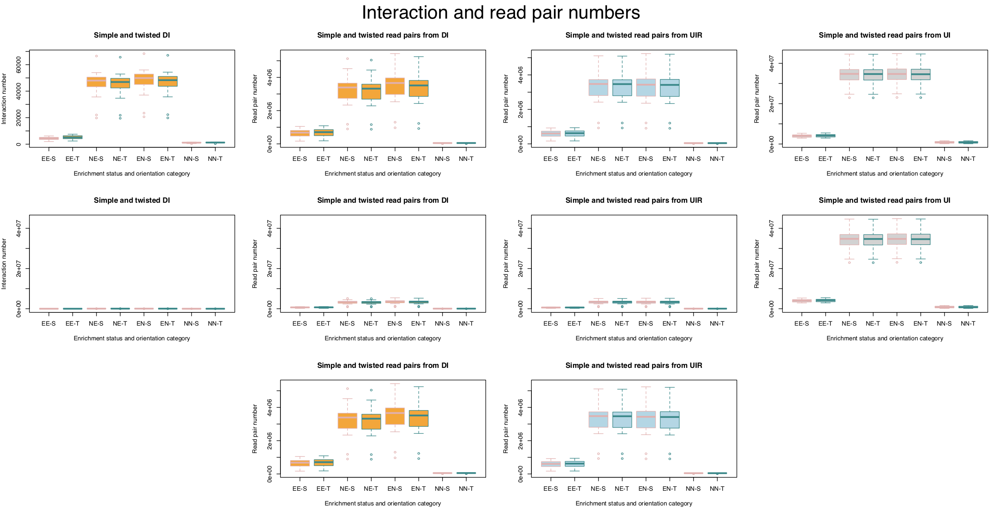

The first column is for directed interactions (DI; orange) and the second through fourth column
are for read pairs from directed (DI; orange), undirected reference (UIR; light blue)
and undirected interactions (UI; gray).
The colors of the borders around the boxes indicate whether the interactions
or read pairs are simple (pink) or twisted (green).
The 2nd row shows the same data as the first row,
but the y-axes are uniform so that the plots of this row can be compared
with one another.
Because of high counts or distances in the outer two columns,
the boxplots for read pairs from DI and UIR can be very compressed.
In order to be able to compare these categories better,
they are shown again in the 3rd row with a common y-axis.

With the boxplots, the counts or distances for *simple* and *twisted* are
shown independently of each other. In the following four rows (rows 4 to 7 in the entire plot)
the values for simple and twisted in the various subcategories are plotted against each other.
We use a t-test to test this hypothesis. The corresponding P-values are shown above the top whiskers.

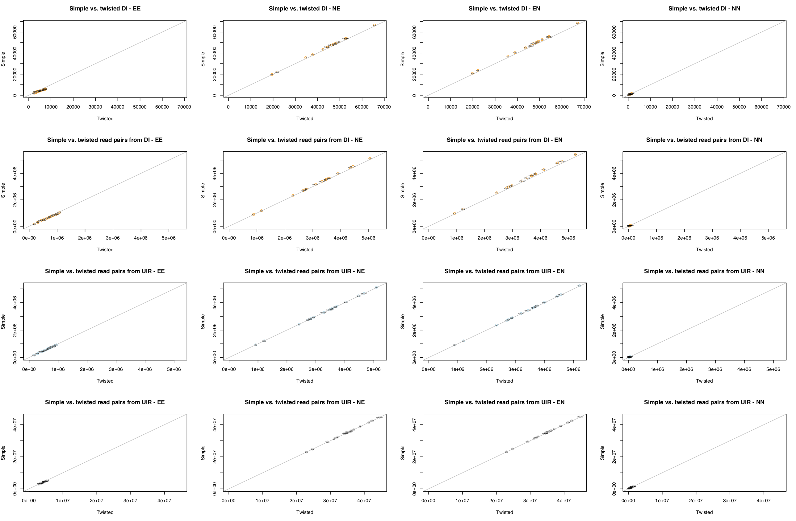

The columns 1 to 4 contain the plots for the enrichment categories EE, NE, EN and NN.
The first row contains the plots for directed interactions
and the rows 2 to 4 contain the plots for read pairs from directed (DI; orange),
undirected reference (UIR; light blue) and undirected interactions c.
The y-axes within each row are comparable.
Under the null hypothesis that the values (n, median or IQR) are independent
of whether interactions or read pairs are simple or twisted, the points in the scatterplots
should lie around the diagonal shown in gray (sometimes below, sometimes above). 

The last three rows (rows 8 to 10 in the entire plot) contain an alternative representation
of the relationship between *simple* and *twisted*.
In this representation, the distribution of differences between simple and twisted
for the 17 cell types are shown in boxplots.

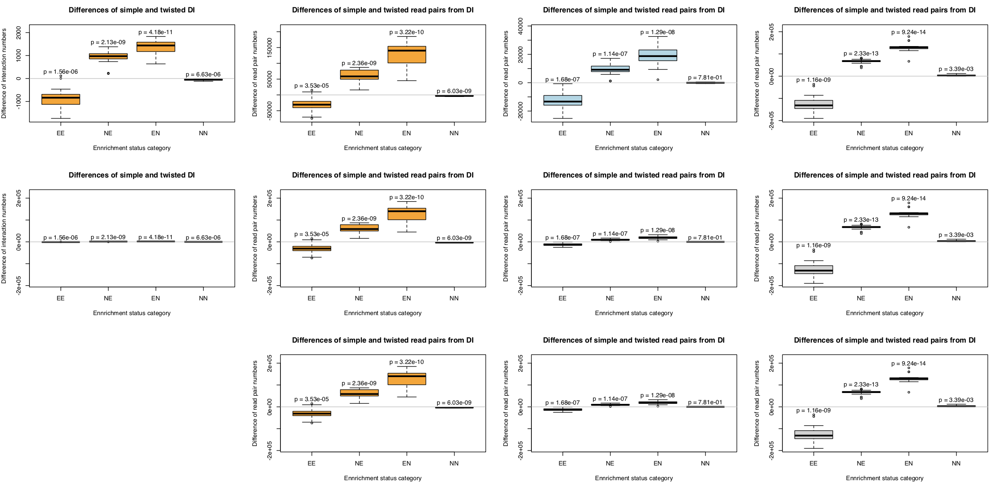

Column 1 contains the plots for directed interactions (DI; orange) and
columns 2 to 4 contain the plots for read pairs from
directed (DI; orange), undirected reference (UIR; light blue)
and undirected interactions (UIR; light blue).
In this representation, the differences should be evenly distributed
around zero (indicated by a gray horizontal line) if the plotted values
are independent of whether interactions (or read pairs) are simple or twisted.

##### Median interaction distances (median)

The following plot has the same structure as the one for
interaction and read pair numbers just described.
But this plot is for medians of interaction distances.

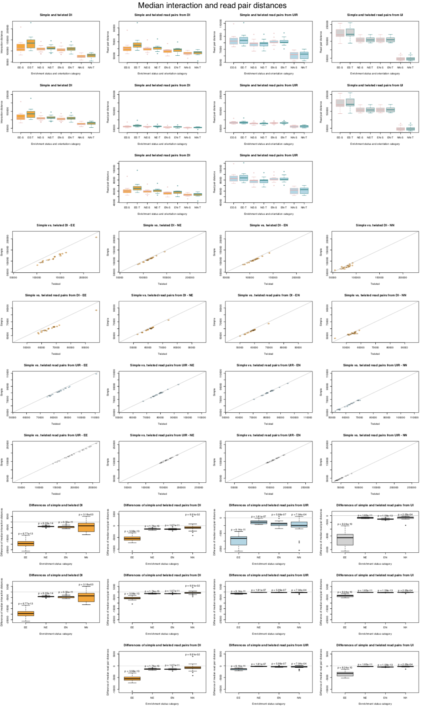

##### Interquartile ranges (IQR)

The following plot has the same structure as the one for
interaction and read pair numbers just described.
But this plot is for interquartile ranges of interaction distances.

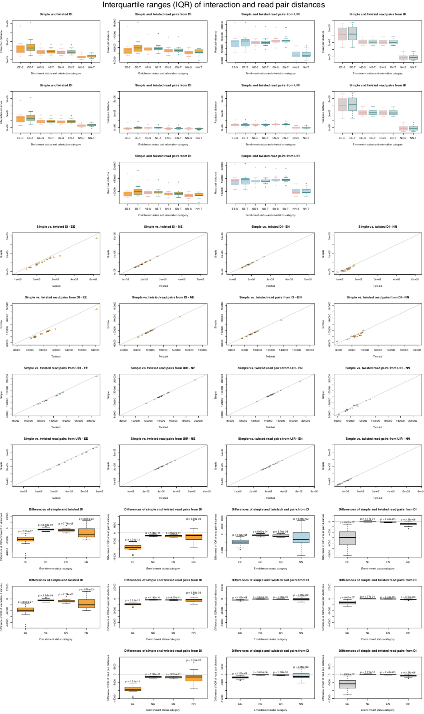


## Analysis of interaction profiles

xxx


