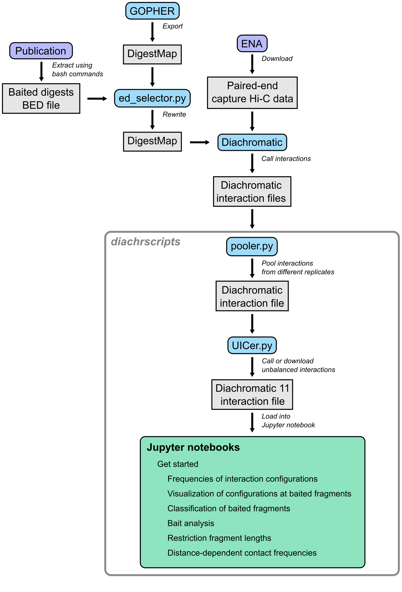

.. _RST_tutorial:

########
Tutorial
########

This tutorial describes the entire workflow from downloading the data, calling the interactions with ``Diachromatic``,
pooling interactions from different replicates, calling unbalanced interactions with ``DICer`` up to the various
analyzes of interactions with unbalanced read counts that can be performed in Jupyter Notebooks.

************************************************
Downloading paired-end Hi-C or capture Hi-C data
************************************************

Use the script
`dumpy.sh <https://github.com/TheJacksonLaboratory/diachrscripts/blob/develop/additional_scripts/dumpy.sh>`__
to download promoter capture Hi-C data on GM12878 cells
`(Mifsud et al. 2015) <https://pubmed.ncbi.nlm.nih.gov/25938943/>`_.
For this dataset, ``XGB`` memory must be available.

.. code-block:: console

    $ dumpy.sh MIF_R1 MIF_R1 "ERR436029"
    $ dumpy.sh MIF_R2 MIF_R2 "ERR436028;ERR436030;ERR436033"
    $ dumpy.sh MIF_R3 MIF_R3 "ERR436026;ERR436031"

A separate directory is created for each of the three replicates.
Because it is paired-end data, there are pairs of forward and reverse FASTQ files with
suffixes ``_1`` and ``_2``.
Both files have the same number of lines and reads with the same line index form a pair.

.. code-block:: console

    $ ls -lh MIF_R*
    MIF_R1:
    total 96G
    -rw-r--r-- 1 hansep robinson-pchi-c 12G Jun 20 02:26 ERR436029_2.fastq.gz
    -rw-r--r-- 1 hansep robinson-pchi-c 35G Jun 20 02:18 MIF_R1_1.fastq
    -rw-r--r-- 1 hansep robinson-pchi-c 34G Jun 20 02:31 MIF_R1_2.fastq
    -rw-r--r-- 1 hansep robinson-pchi-c  62 Jun 20 02:19 MIF_R1_md5.txt

    MIF_R2:
    total 21G
    -rw-r--r-- 1 hansep robinson-pchi-c 7.2G Jun 20 02:29 ERR436028_1.fastq.gz
    -rw-r--r-- 1 hansep robinson-pchi-c  11G Jun 20 02:31 MIF_R2_1.fastq
    -rw-r--r-- 1 hansep robinson-pchi-c    0 Jun 20 02:25 MIF_R2_2.fastq
    -rw-r--r-- 1 hansep robinson-pchi-c    0 Jun 20 02:25 MIF_R2_md5.txt

    MIF_R3:
    total 66G
    -rw-r--r-- 1 hansep robinson-pchi-c 3.8G Jun 20 02:30 ERR436026_1.fastq.gz
    -rw-r--r-- 1 hansep robinson-pchi-c  26G Jun 20 02:17 MIF_R3_1.fastq
    -rw-r--r-- 1 hansep robinson-pchi-c  26G Jun 20 02:26 MIF_R3_2.fastq
    -rw-r--r-- 1 hansep robinson-pchi-c  124 Jun 20 02:26 MIF_R3_md5.txt

Both files contain the same number of reads.

******************************************
Calling interactions with ``Diachromatic``
******************************************

This is described here: :ref:`RST_Interaction_calling`.

**********************************************
Pooling interactions from different replicates
**********************************************

This is described here: :ref:`RST_Combining_interactions`.

**********************************************
Calling unbalanced interactions with ``DICer``
**********************************************

So far, this is only described in this
`Jupyter Notebook <https://github.com/TheJacksonLaboratory/diachrscripts/blob/develop/jupyter_notebooks/Demonstration_of_DICer.ipynb>`__.

******************************************************
Performing various analyzes on unbalanced interactions
******************************************************

We have implemented all analyzes following the calling of unbalanced interactions in different Jupyter Notebooks.

Interaction distances
=====================

See this
`motebook <https://github.com/TheJacksonLaboratory/diachrscripts/blob/develop/jupyter_notebooks/interaction_frequency_distance_analysis.ipynb>`__
and this
`one <https://github.com/TheJacksonLaboratory/diachrscripts/blob/develop/jupyter_notebooks/interaction_frequency_distance_analysis_2.ipynb>`__.

Frequencies of read types and configurations of interactions
============================================================

See this
`motebook <https://github.com/TheJacksonLaboratory/diachrscripts/blob/develop/jupyter_notebooks/read_pair_and_interaction_types.ipynb>`__.

Representation of interactions in triangle heatmaps
===================================================

See this
`motebook <https://github.com/TheJacksonLaboratory/diachrscripts/blob/develop/jupyter_notebooks/dtvis.ipynb>`__.

Classification of baited digests
================================

See this
`motebook <https://github.com/TheJacksonLaboratory/diachrscripts/blob/develop/jupyter_notebooks/interactions_at_baited_digests_select_baited_digests.ipynb>`__.

TAD boundaries
==============

See this
`motebook <https://github.com/TheJacksonLaboratory/diachrscripts/blob/develop/jupyter_notebooks/tad_boundaries.ipynb>`__.

